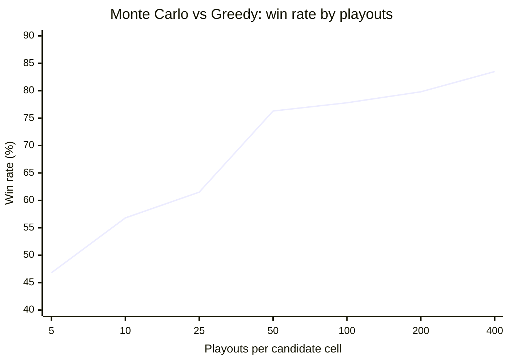

# Balance and calibration

All numbers come from `npm run sim` and `npm run playouts`, which run on the paired-seed match runner in `src/evaluation`. Raw output is in [`results/`](results/).

**Note:** these runs predate two later changes: the switch to the `seedrandom` generator, and ranks stored as labels. The first changed which cards each seed deals; the second made Monte Carlo about 30% slower per move. Re-running the commands gives statistically similar results, not the identical games and timings recorded here.

A match of N games is N/2 **pairs**. Both games of a pair use one seed, with seats and first move swapped (DECISIONS.md D22). "Win rate" counts a draw as ½. CIs are 95% normal intervals over pairs (D23). Timings are Node 18 on a laptop, averaged over whole games.

## 1. Preset ratings

Random is anchored at 800. Each stronger bot is chained off its match against the previous one with `diff = 400·log10(p/(1−p))`.

| Match (stronger bot second) | Games | W–D–L (stronger) | Stronger's win rate (95% CI) | Elo gap | Rating |
|---|---|---|---|---|---|
| — | | | | | **Random 800** |
| Random vs Greedy | 2000 | 1898–46–56 | 96.1% (95.3–96.8%) | +554 | **Greedy 1354** |
| Greedy vs Monte Carlo | 400 | 297–32–71 | 78.3% (74.7–81.8%) | +222 | **Monte Carlo 1576** |

Time per move: Random 0.13 ms, Greedy 0.23–0.31 ms, Monte Carlo (100 playouts) about 18 ms.

These ratings are in [`src/bots/presets/catalog.ts`](src/bots/presets/catalog.ts). They land close to the targets set at the start (~800 / ~1200 / ~1500+).

## 2. Findings

### Finding 1: Among strong players, moving **second** is an advantage

Mirror matches put the same bot on both sides. Two identical deterministic bots on the same deal replay the same game with names swapped, so each *pair* is one independent deal. The table shows the first mover's score per deal:

| Mirror | Independent deals | First mover's score | Distance from 50% |
|---|---|---|---|
| Random vs Random | 2000 | 50.2% | +0.2 SE |
| Greedy vs Greedy | 2000 | 48.6% | −1.3 SE |
| Monte Carlo vs Monte Carlo | 1200 | **45.6%** | **−3.2 SE** |

**Reading:** With random play there's no edge. The edge appears, and grows, as play gets stronger. For Monte Carlo it is significant (p ≈ 0.002) and worth about −30 Elo to the first mover.

**Hypothesis (not yet tested):** The first mover places 13 cards and the second 12, but the 25th placement is forced (one empty cell left), so the first mover's extra card carries no decision. Meanwhile the second mover always acts with one more card of information on the board.

**Implications:**
- The app alternates or lets players choose who starts.
- Paired matches give each bot the first move exactly once per deal, so the edge cancels within every pair.
- A rule fix to test would be letting the second mover place the last card, or a small komi.

### Finding 2: Paired seeds work: identical bots produce zero-variance pairs

Every mirror match above has pair-score standard deviation **0**: each pair splits exactly 1–1 or draws twice. Skill differences are all that pairs can measure, and identical bots have none. Between different bots, the pair-score σ was:
- **0.26** for Greedy vs Monte Carlo;
- **0.13** for Random vs Greedy.

That sets how many games a comparison needs (D23): with σ ≈ 0.26 and 100 pairs, the CI half-width is about ±5%.

### Finding 3: Monte Carlo strength against playout count

Each Monte Carlo variant played 200 games (100 pairs, seed 1) against Greedy (`npm run playouts`). Only the `PLAYOUTS` constant changes.

| Playouts | Win rate vs Greedy (95% CI) | Elo over Greedy | ms per move |
|---|---|---|---|
| 5 | 46.8% (40.5–53.0%) | −23 | 0.5 |
| 10 | 56.8% (50.7–62.8%) | +47 | 2.0 |
| 25 | 61.5% (55.2–67.8%) | +81 | 4.5 |
| 50 | 76.3% (71.1–81.4%) | +203 | 9.3 |
| **100 (preset)** | **77.8% (72.6–82.9%)** | **+217** | **18.0** |
| 200 | 79.8% (74.8–84.7%) | +238 | 36.2 |
| 400 | 83.5% (78.9–88.1%) | +282 | 71.8 |

**Reading:** Strength climbs steeply up to about 50 playouts, then saturates.
- Beyond 50, each doubling **doubles the cost** but buys only about +15 to +45 Elo, and adjacent CIs overlap.
- At 5 playouts the estimate is so noisy that Monte Carlo is no better than the hand-written heuristic.

**Why it saturates:** Past ~50 playouts, sampling noise stops being the bottleneck and the bias of the playout policy takes over. Random playouts don't block, so they systematically overvalue lines a real opponent would kill. More samples of a biased estimate converge to the wrong value.

**Decision:** 100 playouts. That's near the knee, and at about 18 ms per move it stays well under one noticeable pause in the browser. The next gain will come from smarter playouts, not more of them.

### Finding 4: Draw rates fall as play improves

| Games | Draws |
|---|---|
| Random mirror (4000) | 10.7% |
| Greedy mirror (4000) | 10.1% |
| Monte Carlo mirror (2400) | 7.1% |
| Random vs Greedy (2000) | 2.3% |

Mismatched bots rarely draw, as you'd expect. Among equals, the draw rate falls slightly with skill. A plausible explanation (not measured) is that stronger play makes more and bigger rank hands, so equal totals become less likely.

## 3. Proposed next experiments (not done)

- **Second-mover advantage:**
  - test the "forced last card" hypothesis by giving the 25th placement to the second mover;
  - measure the edge against playout count.
- **Smarter Monte Carlo playouts:** use a light greedy policy instead of uniform random. Random playouts don't block, so they overvalue draws a real opponent would kill.
- **Win-probability objective:** maximise P(win) instead of mean score difference, which matches what Elo rewards.
