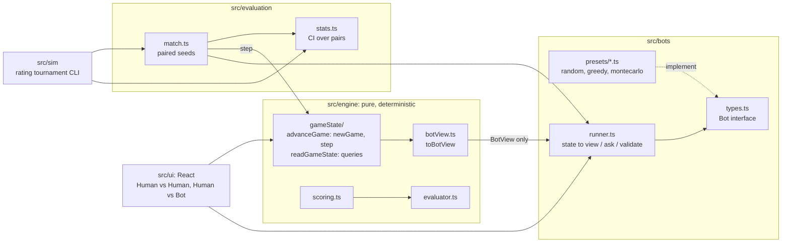

# Poker Grid Duel

A two-player card game on a shared 5×5 grid. One player scores the **rows** as poker hands and the other scores the **columns**, so every card helps one side and maybe the other.

You can play a friend on one screen, or play one of three bots: Random, Greedy and Monte Carlo. The bots are also played against each other over hundreds of seat-swapped games on shared deals, to measure with confidence intervals how strong each one really is.

## Rules

- Shared 5×5 board, standard 52-card deck shuffled from a seed.
- One player scores the 5 **rows**, the other the 5 **columns**. Seat and first move are chosen independently.
- Each turn the top card is revealed (the **current** card), and the card after it is visible too (the **next** card).
- On your turn, **place the current card** in any empty cell. Players alternate until all 25 cells are full.
- Every row and column then holds exactly 5 cards and is scored as a poker hand:

| Hand | Points |
|---|---|
| High card | 0 |
| Pair | 2 |
| Two pair | 5 |
| Three of a kind | 10 |
| Flush | 12 |
| Straight (A-low and A-high, no wrap) | 15 |
| Full house | 20 |
| Four of a kind | 40 |
| Straight flush | 60 |

Higher total wins; equal totals draw.

## Modes

| Mode | What it is |
|---|---|
| **Human vs Human** | Pass-and-play on one screen. Pick Player 1's seat and who moves first. |
| **Human vs Bot** | Play Random, Greedy or Monte Carlo. Pick your seat and who moves first. Each bot shows the Elo rating the tournament measured for it. |

## Running it

```bash
npm install
npm run dev        # play in the browser
npm run check      # typecheck + lint + tests
npm run build      # production build into dist/
npm run sim -- --games=200 --seed=1    # rate the bots
```

`npm run sim` plays each bot against the one listed before it and prints JSON: W/D/L, win rate with its 95% CI, the Elo gap, and the calibrated ratings, with the first bot anchored at 800. These are the ratings shown in the opponent picker. The run behind the current ratings is in [BALANCE.md](BALANCE.md), with the raw output in [`results/`](results/).

## How the bots work

A bot is a TypeScript module that implements one method. It is called on its turn and returns the position of an empty cell:

```ts
interface Bot {
  chooseMove(view: BotView): Position;
}
```

- **`view`** is everything the bot is told: `board`, `mySeat`, `currentCard`, `nextCard`. It holds nothing from the rest of the deck; a bot that wants the cards still to come works them out from what it can see.
- **Randomness** comes from a seeded generator handed to the bot when it is created (`createBot(rng)`), so a tournament run can be repeated exactly.
- **The firewall.** A bot never receives the game state, and an ESLint rule limits what the files in `src/bots/presets/` may import to the rules of the game: types, points table, hand evaluator, scoring, the deck and read-only board functions. Importing what deals or advances a game fails `npm run check`.
- A bot that throws or chooses anything but an empty cell forfeits that game.

| Bot | Strategy | Rating |
|---|---|---|
| Random | A random empty cell. | 800 (anchor) |
| Greedy | Tries the card in every empty cell and keeps the one that most improves its own line's potential minus the opponent's. No lookahead. | 1354 |
| Monte Carlo | For every empty cell, finishes the game at random 100 times on the same sampled futures and keeps the cell with the best average score difference. | 1576 |

The source is in [`src/bots/presets/`](src/bots/presets/). In the app, picking a bot in Human vs Bot shows how its algorithm works step by step, before you start the duel. The ratings come from the tournament (BALANCE.md).

## Architecture



- **Pure engine.** `step(state, move)` returns `{ ok: true, state }` or `{ ok: false, error }`: it never throws on bad input and never mutates. A game is fully defined by `(seed, firstMover, moves[])`, and tests replay games to check it. No `Math.random` or clocks in `engine`, `bots` or `evaluation`; ESLint enforces this.
- **No cheating.** Bots receive only a `BotView`, never the game state, so they cannot see the order of the deck.
- **One path for every bot.** The browser game, the CLI and the tests all run bots through `runner.ts`, which validates each answer.
- **Statistics.** Each seed is played twice with seats and first move swapped (common random numbers). The 95% CI treats each pair, not each game, as one sample.

Every significant choice, with the alternatives considered, is in **[DECISIONS.md](DECISIONS.md)**.

## Project layout

```
src/engine      types, rules (board size, points table), rng, deck, evaluator, scoring, botView, gameState/ (advanceGame, readGameState)
src/bots        types (Bot interface), runner, presets/ (3 bots + catalog)
src/evaluation  match runner, stats (confidence interval, Elo gap)
src/sim         rating tournament CLI, arg parsing
src/ui          App, modes/ (HumanVsHuman, HumanVsBot), components/, useGame
tests           Vitest: engine, evaluator, scoring, bot API, presets, match,
                stats, CLI args
results         raw JSON of the runs quoted in BALANCE.md
```

## Deploying

`.github/workflows/ci.yml` runs typecheck, lint, format check, tests and build on every push. On `main` it deploys `dist/` to GitHub Pages. To enable it, push the repo to GitHub and set Settings → Pages → Source to "GitHub Actions".
